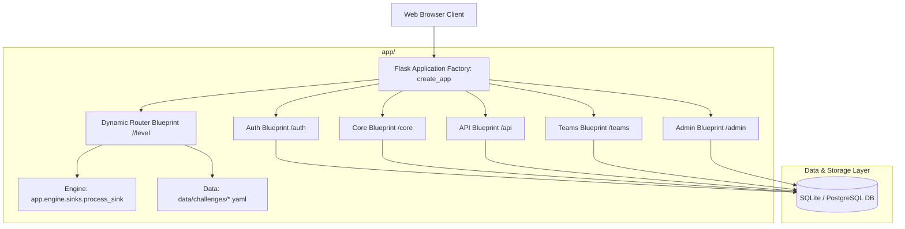
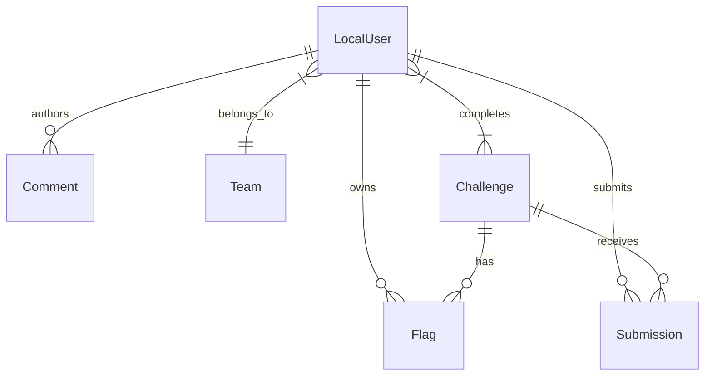

# R00tGlyph v2.0 - Codebase Architecture & Technical Summary

## 📌 Executive Summary
**R00tGlyph v2.0** is an enterprise-grade web security training platform designed for developers, security professionals, and CTF competitors. The platform delivers 188 interactive security challenges spanning 9 major vulnerability categories. It features dynamic challenge routing, real-time input evaluation, per-user flag generation, team-based competition, progressive hint systems, detailed solutions, and an administrative control panel.

---

## 🛠️ Tech Stack & Dependencies

### **Backend Framework & Core Libraries**
- **Language**: Python 3.11+
- **Web Framework**: Flask 2.3.3
- **ORM & Database Abstraction**: Flask-SQLAlchemy 3.0.5
- **Security & CSRF Protection**: Flask-WTF 1.1.1, Werkzeug (PBKDF2 / SHA256 password hashing)
- **Data Serialization & Configurations**: PyYAML 6.0.1, standard `json`
- **WSGI / Production App Server**: Gunicorn 21.2.0

### **Database Layer**
- **Development**: SQLite (`instance/r00tglyph.db`)
- **Production**: PostgreSQL (configured via `DATABASE_URL` environment variable)

### **Frontend & UI**
- **Templating**: Jinja2 HTML5 templates
- **Styling**: Custom CSS with multi-theme support (Dark, Light, Cyberpunk, Hacker)
- **Interactivity**: Vanilla JavaScript, live execution output console, interactive payload references

### **DevOps, Tooling & Testing**
- **Containerization**: Docker (`Dockerfile`), Docker Compose (`docker-compose.yml`)
- **PaaS Deployment**: Render (`render.yaml`), Heroku (`Procfile`), Vercel (`vercel.json`, `vercel_app.py`)
- **Testing**: `pytest`, `pytest-flask` (`tests/`)

---

## 🏗️ System Architecture & Application Flow

### **Application Lifecycle**
1. **Entry Point (`run.py`)**: CLI entry point supporting `--dev`, `--host`, `--port`, `--reset-db`, `--backup`, and `--restore`.
2. **Application Factory (`app/__init__.py`)**: Configures SQLAlchemy, CSRF protection, context processors, and registers six main blueprints.
3. **Dynamic Challenge Engine (`app/routes/challenge_router.py`)**: Intercepts requests for all category levels (`/<category>/level<level>`), loads metadata from `data/challenges/*.yaml`, passes request inputs through `app/engine/sinks.py`, detects exploitation patterns, updates user progress, and issues unique flags.

---

## 🗄️ Data Model & Database Schema (`app/models.py`)

The application models six primary entities along with an association table:

1. **`LocalUser`**: User profile, authentication credentials (`password_hash`), score, admin status (`is_admin`), team membership (`team_id`), rate-limiting metadata (`failed_login_attempts`, `locked_until`).
2. **`Challenge`**: Security challenge details (name, category, difficulty, description, points, active status).
3. **`user_completions`**: Association table linking `LocalUser` to completed `Challenge` records.
4. **`Flag`**: Unique per-user flag per challenge (`R00T{md5_hash}`).
5. **`Submission`**: Audit trail for submitted flags and submission correctness.
6. **`Team`**: Grouping entity for team-based scoreboard competitions.
7. **`Comment`**: Community feedback or discussions per challenge level.

---

## 🌐 Route Inventory & REST APIs

### 1. **Authentication (`app/routes/auth.py`)**
- `GET / POST /register` - User registration with password hashing.
- `GET / POST /login` - User login with rate limiting (10 req / 5 min) and 15-minute account lockout after 5 consecutive failed attempts.
- `GET /logout` - Terminates user session.

### 2. **Core Platform (`app/routes/core.py`)**
- `GET /` - Platform homepage.
- `GET /profile` & `POST /profile` - User profile details and avatar picture upload.
- `GET /challenges` - Vulnerability category overview and user progress dashboard.
- `GET /scoreboard` - Top 20 user rankings, overall platform statistics, and recent flag submissions (optimized via SQLAlchemy joins).
- `GET /team-scoreboard` - Leaderboard of top CTF teams.
- `GET /change-theme/<theme>` - UI theme switcher (Dark, Light, Cyberpunk, Hacker).

### 3. **Dynamic Challenges (`app/routes/challenge_router.py`)**
- `GET / POST /<category>/level<level>` - Universal endpoint routing user payload inputs through `app.engine.sinks.process_sink`, rendering the corresponding template from `templates/<category>/`.

### 4. **API Endpoints (`app/routes/api.py`)**
- `POST /submit-flag` - Validates user flag submission, marks flag as used, updates user points, and records submission.
- `GET / POST /api/notes` - Developer notes demo endpoint (includes XSS level 8 integration).
- `GET /api/hints/<category>/<level>` - Returns hint JSON data from `data/hints/`.
- `GET /api/solutions/<category>/<level>` - Returns solution JSON data from `data/solutions/` (requires challenge completion or admin privileges).
- `GET /solutions/<level>` - Renders full solution walkthrough template.

### 5. **Admin Panel (`app/routes/admin.py`)**
- `GET /admin` - Admin analytics dashboard.
- `GET /admin/users` - User management table.
- `POST /admin/users/<user_id>/toggle-admin` - Promotes/demotes user admin privileges.
- `GET /admin/challenges` - Challenge activation management.
- `POST /admin/challenges/<challenge_id>/toggle` - Enables/disables specific challenges.

### 6. **Teams (`app/routes/teams.py`)**
- `GET /teams` - Overview of all registered CTF teams.
- `GET / POST /teams/create` - Creates a new CTF team.
- `POST /teams/join/<team_id>` - Joins an existing team.
- `POST /teams/leave` - Leaves current team.
- `GET /teams/<team_id>` - Team profile and member breakdown.

---

## 🎯 Vulnerability Categories & Challenge Spectrum (188 Challenges)

| Category | Level Count | Focus Areas & Exploitation Targets |
| :--- | :--- | :--- |
| **XSS** | 30 Levels | Reflected, DOM-based, Stored, WAF Bypasses, CSP Bypasses, Prototype Pollution, SVG/CDATA, WebAssembly, WebRTC. |
| **SQLi** | 23 Levels | Basic, Search, UNION-based, Blind, Time-based, Error-based, Second-order, NoSQL, GraphQL, ORM injection. |
| **CMDi** | 23 Levels | Command chaining, Filter bypasses, Blind execution, File uploads, WAF bypass, JSON/XML APIs, Container escapes. |
| **CSRF** | 23 Levels | Form CSRF, GET-based, JSON CSRF, SameSite bypasses, Custom headers, Multi-step CSRF, WebSockets, GraphQL mutations. |
| **SSRF** | 23 Levels | Internal network scanning, Cloud metadata (169.254.169.254), DNS exfiltration/rebinding, Webhooks, Protocol smuggling. |
| **XXE** | 23 Levels | Basic file disclosure, DOCTYPE restrictions, SYSTEM entity, Out-of-band (OOB), Billion Laughs DoS, SVG uploads. |
| **SSTI** | 23 Levels | Jinja2, Twig, Freemarker, Sandbox escape, Class exploration, Remote Code Execution (RCE). |
| **Deserialization** | 10 Levels | Python pickle, PHP serialize, Java, .NET, YAML deserialization payloads. |
| **Auth Bypass** | 10 Levels | SQLi in login, JWT manipulation, Session fixation, OAuth, MFA bypasses. |

---

## 🔒 Security Architecture & Defensive Mechanisms

1. **CSRF Protection**: Global CSRF protection enabled via `Flask-WTF` `CSRFProtect`, with explicit exemption (`csrf.exempt`) on `dynamic_router_bp` so challenge attack payloads can execute freely without token failure.
2. **Rate Limiting**: Built-in memory rate limiter (`app/utils.py`) enforcing:
   - Login: 10 requests per 5 minutes per IP address.
   - Flag Submission: 30 requests per minute per user ID.
3. **Account Lockout**: 5 failed login attempts trigger a 15-minute account lockout (`locked_until`).
4. **Per-User Flag Isolation**: Flags are uniquely generated for each user and challenge combination using MD5 hashing of user ID, challenge ID, and high-entropy random bytes, preventing flag sharing among users.
